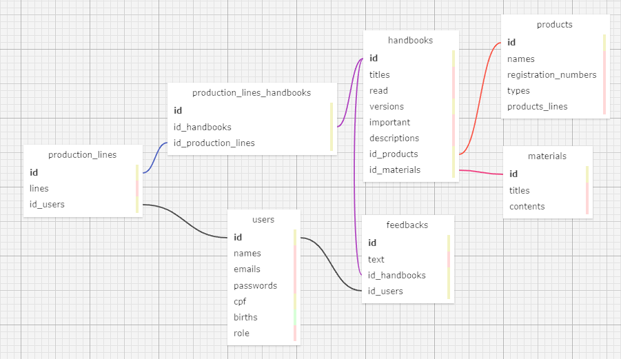

# Modelagem de Banco de Dados

 
&nbsp;&nbsp;&nbsp;&nbsp; A imagem abaixo apresenta uma modelagem de banco de dados, a qual foi desenvolvida para o projeto proposto pela Dell. As tabelas foram criadas com base nos requisitos anunciados pelo parceiro, como, por exemplo, a criação e edição de manuais (conjunto de arquivos que explicam a montagem de determinado produto da marca) ou a necessidade de um espaço para feedbacks por parte dos funcionários sobre cada manual. 

  

  

 
&nbsp;&nbsp;&nbsp;&nbsp; Como é possível notar, existem três tabelas principais, isto é, sem chave estrangeira. Elas são:

- **users:** esas tabela irá conter as informações sobre o funcionário, incluindo suas informação de cadastro ("emails" e "passwords") e sua função dentro da fábrica ("roles").

- **materials:** essa tabela guardará os conteúdos dos manuais, como PDFs, vídeos e modelos 3D, por exemplo, e seus respectivos tipos de arquivo.

- **products:** já essa tabela, conterá as informações sobre todos os produtos produzidos na fábrica, abrangendo, iclusive, o número de série ("registration_numbers") como uma forma de garantir que não serão publicados dois manuais sobre o mesmo produto.

  